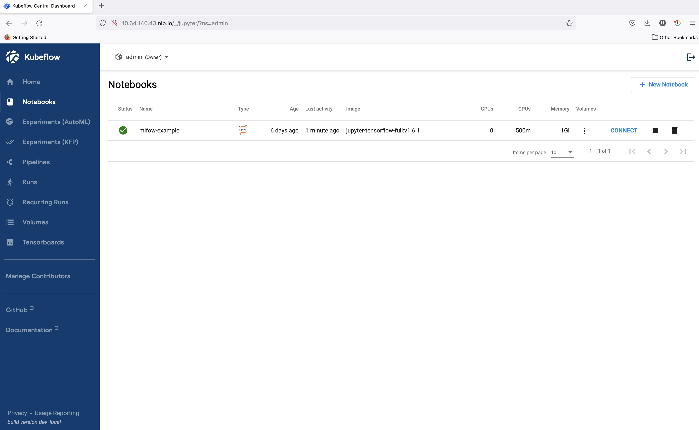

==========================
Install Kubeflow on Nimbus
==========================

`Get started with Charmed Kubeflow <https://charmed-kubeflow.io/docs/get-started-with-charmed-kubeflow>`_

This document will introduce you to all you need to know to get started with Charmed Kubeflow on Nimbus.

**Prerequisites**:

To keep things simple, we are going to make the following assumptions:

* You run Ubuntu 20.04(focal) or later.
* You have at least 32GB free memory and 50GB of disk space
* You have access to the internet for downloading the required snaps and charms.

**Contents**:

Part I: Create a Nimbus Ubuntu 20.04 VM
=======================================

.. code-block::

    # login DBC account to deloy ubuntu 20.04 vm on nimbus
    # username/password: vmware/B1gd3m0z
    nimbus deploy ovf atlas-ubuntu-vm-3 http://sc-prd-rdops-templates.eng.vmware.com/nimbus-templates/atlas-ubuntu-20-4/atlas-ubuntu-20-04/atlas-ubuntu-20-04.ovf --cpus=16

    # login this vm, and edit /etc/environment and remove proxy related env. vars, then reboot
 

Part II: Access Charmed Kubeflow
================================

During the process you will:

* Login Nimbus VM created before
* Install MicroK8s
* Install Juju
* Deploy Charmed Kubeflow
* Set up 5 of the main components of Charmed Kubeflow: Notebooks, Pipelines, Katib

Please note that this tutorial is dedicated to users who aim to install Charmed Kubeflow on their own machine or on a virtual machine with direct access to the browser. In case you run it on a public cloud, the deployment process is the same, but please follow these `instructions <https://charmed-kubeflow.io/docs/dashboard>`_ for accessing the dashboard.

Login Nimbus VM created before
------------------------------

The journey of access Charmed Kubeflow will start from login Nimbus VM.

.. code-block::

    ssh -D localhost:1080 vmware@<vm_machine_public_ip>

Install and prepare MicroK8s
------------------------------

The first step on our journey is to install `MicroK8s <https://microk8s.io/>`_. MicroK8s is installed from a snap package. The published snap maintains different channels for different releases of Kubernetes.

.. code-block:: 

    sudo snap install microk8s --classic --channel=1.24/stable

For MicroK8s to work without having to use sudo for every command, it creates a group called microk8s. To make it more convenient to run commands, you will add the current user to this group:

.. code-block:: 

    sudo usermod -a -G microk8s $USER
    newgrp microk8s

It is also useful to make sure the user has the proper access and ownership of any kubectl configuration files:

.. code-block:: 

    sudo chown -f -R $USER ~/.kube

MicroK8s will start up as soon as it is installed. It is a completely functional Kubernetes, running with the least amount of overhead possible. However, for our purposes we will need a Kubernetes with a few more features. A lot of extra services are available as MicroK8s “add-ons” - code which is shipped with the snap and can be turned on and off when it is needed. We can now enable some of these features to get a Kubernetes where we can usefully install Kubeflow. We will add a DNS service, so the applications can find each other, storage, an ingress controller so we can access Kubeflow components and the MetalLB load balancer application. These will be enabled simply at the same time:

.. code-block:: 

    microk8s enable dns storage ingress metallb:10.64.140.43-10.64.140.49

You can see that we added some detail when enabling MetalLB, in this case the address pool to use. Many of the add-ons have extra configuration options, which can be found in the `MicroK8s documentation <https://microk8s.io/docs/addon-metallb>`_.

It will take minimum 5 minutes for MicroK8s to install and set up these additional features. Before we do anything else, we should check that the add-ons have been enabled successfully and that MicroK8s is ready for action. We can do this by requesting the status, and supplying the --wait-ready option, which tells microk8s to finish whatever processes it is working on before returning:

.. code-block:: 

    microk8s status --wait-ready

Now we have a working Kubernetes ready, the next step is to install Juju.

Install Juju
------------

`Juju <https://juju.is/>`_ is an operation Lifecycle manager(OLM) for clouds, bare metal or Kubernetes. We will be using it to deploy and manage the components which make up Kubeflow.
As with MicroK8s, Juju is installed from a snap package:

.. code-block::

    sudo snap install juju --classic

As Juju already has a built-in knowledge of MicroK8s and how it works, there is no additional setup or configuration needed. All we need to do is run the command to deploy a Juju controller to the Kubernetes we set up with MicroK8s:

.. code-block::

    juju bootstrap microk8s

The controller is Juju’s agent, running on Kubernetes, which can be used to deploy and control the components of Kubeflow.

The controller can work with different ``models``, which map to namespaces in Kubernetes. You set up a specific model for Kubeflow:

.. code-block::

    juju add-model kubeflow

Model name must be Kubeflow: Due to an assumption made in the upstream Kubeflow Dashboard code, Kubeflow must be deployed in the Kubernetes namespace ``kubeflow`` and so we have to use the model name ``kubeflow`` here.

That’s it for installing Juju!

Deploying Charmed Kubeflow
--------------------------

Charmed Kubeflow is really a collection of charms. Each of these charms deploy and control one application which goes to make up Kubeflow. You can actually just install the components you want, by individually deploying the charms and relating them to each other to build up Kubeflow. The bundles are really a recipe for a particular deployment of Kubeflow, configuring and relating the applications so you end up with a working deployment with the minimum of effort.

.. code-block::

    juju deploy kubeflow --trust

Juju will now fetch the applications and begin deploying them to the MicroK8s Kubernetes. This process can take several minutes. You can track the progress by running:

.. code-block::

    watch -c juju status --color

This will show a list of the applications and their current status. Don’t be surprised if a few show up error messages to begin with - a lot of the components rely on the operation of others, so it can take up to 20 minutes before everything is ready and talking to one another.

While that is going in, there are two pieces of post-install configuration which can usefully be done at this point.

Configure the components
------------------------

For authentication and allowing access to the dashboard service, some components will need to be configured with the URL to be allowed. This depends on the underlying network provider, but for the known case of running on a local MicroK8s, we also know what the URL will be. It is configured with Juju using the following commands:

.. code-block::

    juju config dex-auth public-url=http://10.64.140.43.nip.io
    juju config oidc-gatekeeper public-url=http://10.64.140.43.nip.io

Finding the URL: If you have a different setup for MicroK8s, or you are adapting this tutorial for a different Kubernetes, you can find the URL required by examining the IP address of the ``istio-ingressgateway`` service. For example, you can determinine this information using kubectl: ``microk8s kubectl -n kubeflow get svc istio-ingressgateway-workload -o jsonpath='{.status.loadBalancer.ingress[0].ip}'``

To enable simple authentication, and set a username and password for your Kubeflow deployment, run the following commands:

.. code-block::

    juju config dex-auth static-username=admin
    juju config dex-auth static-password=admin

Feel free to use a different (more secure!) password if you wish.

Login to Charmed Kubeflow
-------------------------

Please note that if you are in a public cloud, follow `this guide <https://charmed-kubeflow.io/docs/dashboard>`_.
The URL for the Kubeflow dashboard is the same as the one determined earlier for the configuration steps - in the case of a default MicroK8s install, it’s: http://10.64.140.43.nip.io

From a browser on your local machine, this can be reached just by copying and pasting the URL. You should then see the dex login screen, where you should enter the username( it does say email address, but whatever string you entered to configure it will work fine) and your password from the configuration step.

However, for remote deployments, or running on a virtual machine, creating a SOCKS proxy is required to access the dashboard. This can be done as follows:

1. Connection to the machine using ssh with SOCKS proxy enabled through the -D 1080 parameter. As in the example below:

.. code-block::

    ssh -D localhost:1080 vmware@<vm_machine_public_ip>

2. Go to the browser on your computer, go to Settings > Network > Network Proxy, and enable SOCKS proxy pointing to: 127.0.0.1:1080. If it's firfox browser, the setting is as below:

.. image:: images/firfox-socket-setting.png

If it's chrome browser, the setting is as below:

.. image:: images/chrome-socket-setting.png

You should now see the Kubeflow “Welcome” page:

.. image:: images/welcome.png

Click on the “Start Setup” button. On the next screen you will be asked to create a namespace. This is just a way of keeping all the files and settings from one project in a single, easy-to-access place. You can choose any name you like…

.. image:: images/namespace.png

Once you click on the “Finish” button, the Dashboard will be displayed!

.. image:: images/dashboard.png

Part III: Get started with Charmed Kubeflow 
===========================================

Charmed Kubeflow Dashboard
--------------------------

The Kubeflow Dashboard combines some quick links to the UI for various components of your Kubeflow deploy (Notebooks, Pipelines, Katib) as well as shortcuts to recent actions and some handy links to the upstream Kubeflow documentation.

Kubeflow Notebooks
------------------

Kubeflow Notebooks provides a way to run web-based development environments inside your Kubernetes cluster by running them inside Pods. `Read more <https://www.kubeflow.org/docs/components/notebooks/overview/#:~:text=Kubeflow%20Notebooks%20provides%20a%20way,Code%20(code%2Dserver).>`_ about them in the upstream documentation.

Create a Kubeflow Notebook
^^^^^^^^^^^^^^^^^^^^^^^^^^
This Dashboard will give you an overview of the Notebook Servers currently available on your Kubeflow installation. In a freshly installed Kubeflow there will be no Notebook Server.
You will create a new Notebook Server by clicking on ``Notebooks`` in the left-side navigation and then clicking on the ``New notebook`` button.

In the ``New Notebook`` section you will be able to specify several options for the notebook you are creating. In the image section choose an image of ``jupyter-tensorflow-full``, it is required for our example notebook. Please leave the CPU and memory requirements to the default ones.

Once the Notebook Server is created you connect to it, by clicking on the “Connect” button from the left side to it and access your Jupyter Notebook environment which will be opened in a new tab.

For testing the server we will upload the `Tensorflow 2 quickstart for experts example <https://www.tensorflow.org/tutorials/quickstart/advanced>`_.

Click on the link above and click on the ``Download Notebook`` button just below the heading. This will download the file ``advanced.ipynb`` into your usual Download location. This file will be used to create the example notebook.

On the ``Notebook Server`` page, click on the Upload button, which is located in the side-bar, at the top, and select the ``advanced.ipnyb`` file.

.. image:: images/notebook-jupyter.png

Once uploaded, click on the notebook name to open a new tab with the notebook content.

.. image:: images/notebook-jupyter-advance.png

Once uploaded, click on the notebook name to open a new tab with the notebook content.

You can read through the content for a better understanding of what this notebook does. Click on the Run button to execute each stage of the document, or click on the double-chevron (>>) to execute the entire document.

Kubeflow Notebook Volume
^^^^^^^^^^^^^^^^^^^^^^^^

In order to see the volume of the notebook that you just created in the previous step, please click on Volumes on the left side-bar. You will see a volume that has the same name as the notebook with ”-volume” at the end.

.. image:: images/notebook-volume.png

Delete a Kubeflow Notebook
^^^^^^^^^^^^^^^^^^^^^^^^^^

In order to delete a new Notebook, you will click on Notebooks in the left-side navigation. Go to the notebook you want to delete, an click on the small trash bin icon situated alongside the Notebook.

.. image:: images/notebook-delete01.png

A new window will appear on your screen. Click “Delete”.

.. image:: images/notebook-delete02.png

Kubeflow Pipeline
-----------------

The `official Kubeflow Documentation <https://www.kubeflow.org/docs/pipelines/>`_ explains the recommended workflow for creating a pipeline. This documentation is well worth reading thoroughly to understand how pipelines are constructed. For this example run-through though, we can take a shortcut and use one of the `Kubeflow testing pipelines <https://github.com/canonical/bundle-kubeflow/blob/master/tests/pipelines/mnist.py>`_.

Install pipeline compiler
^^^^^^^^^^^^^^^^^^^^^^^^^

To install the pipeline compiler tools, you will need to first have Python 3 available, and whichever ``pip`` install tool is relevant for your OS. On Ubuntu 20.04 and similar systems:

.. code-block::

    sudo apt update
    sudo apt install python3-pip

Next, use pip to install the Kubeflow Pipeline package

.. code-block::

    pip3 install kfp

(depending on your operating system, you may need to use pip instead of pip3 here, but make sure the package is installed for Python3)

Get a pipeline example
^^^^^^^^^^^^^^^^^^^^^^

Next fetch the Kubeflow repository:

.. code-block::

    git clone https://github.com/canonical/bundle-kubeflow.git

The example pipelines are Python files, but to be used through the dashboard, they need to be compiled into a YAML. The ``dsl-compile`` command can be used for this usually, but for code which is part of a larger package, this is not always straightforward. A reliable way to compile such files is to execute them as a python module in interactive mode, then use the ``kfp`` tools within Python to compile the file.

Compile pipeline
^^^^^^^^^^^^^^^^

First, change to the right directory:

.. code-block::

    cd bundle-kubeflow/tests

Then execute the pipelines/mnist.py file as a module:

.. code-block::

    python3 -i -m pipelines.mnist

With the terminal now in interactive mode, we can import the ``kfp`` module:

.. code-block::

    import kfp

… and execute the function to compile the YAML file:

.. code-block::

    kfp.compiler.Compiler().compile(mnist_pipeline, 'mnist.yaml')

In this case, ``mnist_pipeline`` is the name of the main pipeline function in the code, and ``mnist.yaml`` is the file we want to generate.

Add the compiled pipeline
^^^^^^^^^^^^^^^^^^^^^^^^^

Once you have the compiled YAML file (or downloaded it from the link above) go to the Kubeflow Pipelines Dashboard and click on the ``Upload Pipeline`` button.

In the upload section choose the “Upload a file” section and choose the mnist.yaml file. Then click “Create” to create the pipeline.

.. image:: images/pipeline-uploaded.png

Once the pipeline is created we will be redirected to its Dashboard. Create an experiment first:  

.. image:: images/pipeline-create-experiment.png

Execute the pipeline
^^^^^^^^^^^^^^^^^^^^

Once the experiment is added, you will be redirected to ``Start a Run``. For this test select ‘One-off’ run and leave all the default parameters and options. Then click ``Start`` to create your first Pipeline run!

.. image:: images/pipeline-execute.png

Look at results
^^^^^^^^^^^^^^^

Once the run is started, the browser will redirect to ``Runs``, detailing all the stages of the pipeline run. After a few minutes there should be a checkpoint showing that it has been executed successfully.

.. image:: images/pipeline-execute-result01.png

In order to see it, you click on it and a new window will open that will show all the steps of the pipeline that has been executed. After that, you will click on the first name of the pipeline, Loadtask and a new window will open on the right side.

.. image:: images/pipeline-execute-result02.png

Delete pipeline
^^^^^^^^^^^^^^^

In order to delete the pipeline, you need to select it, using the thick box placed on the left side of the name. Then, go to the top right corner, and click ``Delete``

A new window will appear, that asks you to confirm the pipeline deletion. Click again on “Delete”

.. image:: images/pipeline-delete.png

That’s it, your pipeline is now deleted!

Katib
-----

If you are unfamiliar with Katib and hyperparameter tuning, plenty of information is available on the upstream `Kubeflow documentation <https://www.kubeflow.org/docs/components/katib/overview/>`_. In summary, Katib automates the tuning of machine learning ``hyperparameters`` - those which control the way and rate at which the AI learns; as well as offering neural architecture search features to help you find the optimal architecture for your model. By running experiments, Katib can be used to get the most effective configuration for the current task.

Each experiment represents a single tuning operation and consists of an objective (what is to be optimised), a search space(the constraints used for the optimisation) and an algorithm(how to find the optimal values).

You can run Katib Experiments from the UI and from CLI.

For CLI execute the following commands:

.. code-block::
    
    curl https://raw.githubusercontent.com/kubeflow/katib/master/examples/v1beta1/hp-tuning/grid.yaml > grid-example.yaml

    yq -i '.spec.trialTemplate.trialSpec.spec.template.metadata.annotations."sidecar.istio.io/inject" = "false"' grid-example.yaml

    kubectl apply -f grid-example.yaml

the yq command is used to disable istio sidecar injection in the .yaml, due to its incompatibility with Katib experiments. Find more details in `upstream docs <https://www.kubeflow.org/docs/components/katib/hyperparameter/>`_.

If you are using a different namespace than ``kubeflow`` make sure to change that in ``grid-example.yaml`` before applying the manifest.

These commands will download an example which will create a katib experiment. We can inspect experiment progress using ``kubectl`` by running the following command:

.. code-block::

    kubectl -n kubeflow get experiment grid-example -o yaml

We can also use the UI to run the same example. Go to ``Experiments (AutoML)``, and select “New Experiment”.

.. image:: images/katib01.png

Save the contents of `this YAML file <https://raw.githubusercontent.com/kubeflow/katib/master/examples/v1beta1/hp-tuning/grid.yaml>`_ as grid-example.yaml. Open it and edit it, adding ``sidecar.istio.io/inject="false"`` under .spec.trialTemplate.trialSpec.spec.template.metadata.annotations as shown here:

.. code-block::

    ---
    apiVersion: kubeflow.org/v1beta1
    kind: Experiment
    metadata:
    name: grid
    spec:
    objective:
        type: maximize
        goal: 0.99
        objectiveMetricName: Validation-accuracy
        additionalMetricNames:
        - Train-accuracy
    algorithm:
        algorithmName: grid
    parallelTrialCount: 1
    maxTrialCount: 1
    maxFailedTrialCount: 1
    parameters:
        - name: lr
        parameterType: double
        feasibleSpace:
            min: "0.001"
            max: "0.01"
            step: "0.001"
        - name: num-layers
        parameterType: int
        feasibleSpace:
            min: "2"
            max: "5"
        - name: optimizer
        parameterType: categorical
        feasibleSpace:
            list:
            - sgd
            - adam
            - ftrl
    trialTemplate:
        primaryContainerName: training-container
        trialParameters:
        - name: learningRate
            description: Learning rate for the training model
            reference: lr
        - name: numberLayers
            description: Number of training model layers
            reference: num-layers
        - name: optimizer
            description: Training model optimizer (sdg, adam or ftrl)
            reference: optimizer
        trialSpec:
        apiVersion: batch/v1
        kind: Job
        spec:
            template:
            metadata:
                annotations:
                sidecar.istio.io/inject: "false"
            spec:
                containers:
                - name: training-container
                    image: docker.io/kubeflowkatib/mxnet-mnist:latest
                    command:
                    - "python3"
                    - "/opt/mxnet-mnist/mnist.py"
                    - "--batch-size=64"
                    - "--lr=${trialParameters.learningRate}"
                    - "--num-layers=${trialParameters.numberLayers}"
                    - "--optimizer=${trialParameters.optimizer}"
                restartPolicy: Never
    
Refer to the previous section using CLI for clarification on adding this field.

Click the link labelled “Edit and submit YAML”, and paste the contents of the yaml file. Remember to change the namespace field in the metadata section to the namespace where you want to deploy your experiment. Afterwards we will click ``Create``.

.. image:: images/katib02.png

Once the experiment has been submitted, go to the Katib Dashboard and select the experiment.

.. image:: images/katib03.png

In the Experiment Details view, you can see how your experiment is progressing.

.. image:: images/katib04.png 

When the experiment completes, you will be able to see the recommended hyperparameters.

.. image:: images/katib05.png 

Tensorboard
-----------